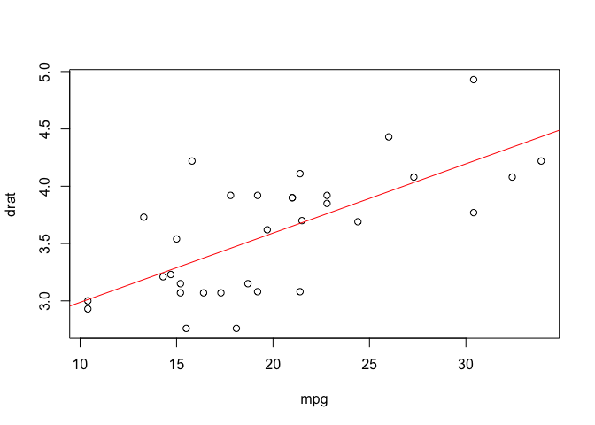
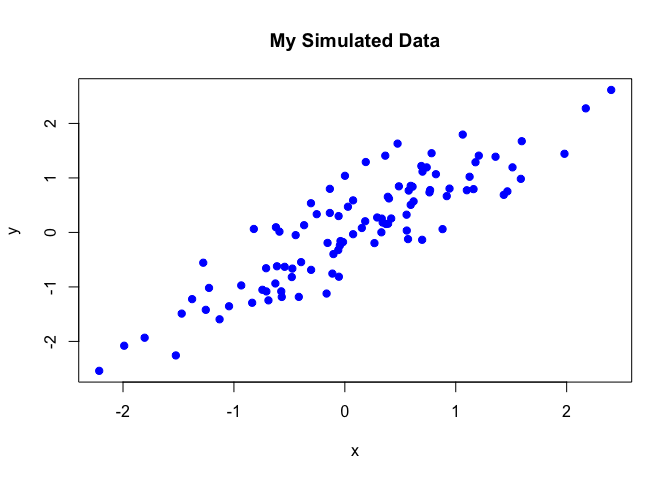

This is some text (i.e. a "text chunk").

Here is a code chunk

```r
set.seed(1)
x <- rnorm(100)
mean(x)
```

# Chunk names

Code chunks can have names (useful for when making graphics)

```r
library(datasets)

plot(drat ~ mpg, data = mtcars)
abline(lm(drat ~ mpg, data = mtcars), col = "red")
```

<!-- -->

# In-line computations

We can perform in-line computations as well:

```r
time <- format(Sys.time(), "%a %b %d %X %Y")
rand <- rnorm(1)
```

The current time is: **Tue Jan 19 08:46:17 2021**. A random number is: **-0.6203667**.

# Incorporating graphs

Let's first simulate some data:


```r
set.seed(1)
x <- rnorm(100)
y <- x + rnorm(100, sd = 0.5)
```

Here is the scatterplot of this simulated data
<!-- -->


