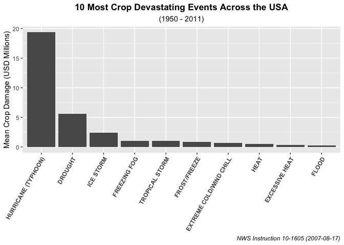

# Synopsis

The purpose of this markdown is to document the start-to-finish analysis of NOAA's storm data from 1950 to 2011. First, we will ensure that our directory structure is set up correctly, with the correct files downloaded from URLs and in the correct directory. Then, we will begin the long and laborious process of tidying the messy data into something much more pliable for our analysis. Since there is a discrepancy between pre-1993 and post-1993 cataloging styles, we will segment our set before using regex and approximate matching to clean up the messiest part of the data: Event Types. We'll see that the fatalities and injuries data is already logged correctly, so no further processing will be required. Then, we will clean up the property and crop damage variables, as they are split up the number and the suffix (a letter to denote the multiplier of the number). Finally, after all the data is tidied up to our specification, we will answer two core questions:

1. Across the United States, which types of events are most harmful with respect to population health?
2. Across the United States, which types of events have the greatest economic consequences?

Let's get started.

# Data Processing

## House-keeping


```r
library("dplyr")
library("R.utils")
library("stringr")
library("stringdist")
library("lubridate")
library("ggplot2")
library("reshape2")
```


```r
# create data directory
if (!dir.exists("data")) {
        dir.create("data")
}
```

Note: the storm events file was self-generated and it is available [here][1]. The data were generated from section **2.1.1 - Storm Data Event Table** in the [StormData-Documentation][2] PDF file.


```r
# data file
download.file(url = "https://d396qusza40orc.cloudfront.net/repdata%2Fdata%2FStormData.csv.bz2",
              destfile = "data/repdata-data-StormData.csv.bz2")

# documentation file
download.file(url = "https://d396qusza40orc.cloudfront.net/repdata%2Fpeer2_doc%2Fpd01016005curr.pdf",
              destfile = "StormData-Documentation.pdf")

# storm events file -- produced from section 2.1.1 (page 6 of PDF)
download.file(url = "https://raw.githubusercontent.com/ryancey1/datascience-coursera/main/4-reproducible-research/week4/data/events.txt",
              destfile = "data/events.txt")
```


```r
# read in stormData and eventTypes tables
stormData <- read.csv("data/repdata-data-StormData.csv.bz2")
eventTypes <- read.delim("data/events.txt")
```

## Tidying the data

### Observing our raw `stormData`

First things first, we should quickly look at the structure of the raw data, as well as the head/tail of the loaded table. This will help us to get a feel of the data we want to process.


```r
head(stormData)
```

```
##   STATE__           BGN_DATE BGN_TIME TIME_ZONE COUNTY COUNTYNAME STATE  EVTYPE
## 1       1  4/18/1950 0:00:00     0130       CST     97     MOBILE    AL TORNADO
## 2       1  4/18/1950 0:00:00     0145       CST      3    BALDWIN    AL TORNADO
## 3       1  2/20/1951 0:00:00     1600       CST     57    FAYETTE    AL TORNADO
## 4       1   6/8/1951 0:00:00     0900       CST     89    MADISON    AL TORNADO
## 5       1 11/15/1951 0:00:00     1500       CST     43    CULLMAN    AL TORNADO
## 6       1 11/15/1951 0:00:00     2000       CST     77 LAUDERDALE    AL TORNADO
##   BGN_RANGE BGN_AZI BGN_LOCATI END_DATE END_TIME COUNTY_END COUNTYENDN
## 1         0                                               0         NA
## 2         0                                               0         NA
## 3         0                                               0         NA
## 4         0                                               0         NA
## 5         0                                               0         NA
## 6         0                                               0         NA
##   END_RANGE END_AZI END_LOCATI LENGTH WIDTH F MAG FATALITIES INJURIES PROPDMG
## 1         0                      14.0   100 3   0          0       15    25.0
## 2         0                       2.0   150 2   0          0        0     2.5
## 3         0                       0.1   123 2   0          0        2    25.0
## 4         0                       0.0   100 2   0          0        2     2.5
## 5         0                       0.0   150 2   0          0        2     2.5
## 6         0                       1.5   177 2   0          0        6     2.5
##   PROPDMGEXP CROPDMG CROPDMGEXP WFO STATEOFFIC ZONENAMES LATITUDE LONGITUDE
## 1          K       0                                         3040      8812
## 2          K       0                                         3042      8755
## 3          K       0                                         3340      8742
## 4          K       0                                         3458      8626
## 5          K       0                                         3412      8642
## 6          K       0                                         3450      8748
##   LATITUDE_E LONGITUDE_ REMARKS REFNUM
## 1       3051       8806              1
## 2          0          0              2
## 3          0          0              3
## 4          0          0              4
## 5          0          0              5
## 6          0          0              6
```

```r
tail(stormData)
```

```
##        STATE__           BGN_DATE    BGN_TIME TIME_ZONE COUNTY
## 902292      47 11/28/2011 0:00:00 03:00:00 PM       CST     21
## 902293      56 11/30/2011 0:00:00 10:30:00 PM       MST      7
## 902294      30 11/10/2011 0:00:00 02:48:00 PM       MST      9
## 902295       2  11/8/2011 0:00:00 02:58:00 PM       AKS    213
## 902296       2  11/9/2011 0:00:00 10:21:00 AM       AKS    202
## 902297       1 11/28/2011 0:00:00 08:00:00 PM       CST      6
##                                  COUNTYNAME STATE         EVTYPE BGN_RANGE
## 902292 TNZ001>004 - 019>021 - 048>055 - 088    TN WINTER WEATHER         0
## 902293                         WYZ007 - 017    WY      HIGH WIND         0
## 902294                         MTZ009 - 010    MT      HIGH WIND         0
## 902295                               AKZ213    AK      HIGH WIND         0
## 902296                               AKZ202    AK       BLIZZARD         0
## 902297                               ALZ006    AL     HEAVY SNOW         0
##        BGN_AZI BGN_LOCATI           END_DATE    END_TIME COUNTY_END COUNTYENDN
## 902292                    11/29/2011 0:00:00 12:00:00 PM          0         NA
## 902293                    11/30/2011 0:00:00 10:30:00 PM          0         NA
## 902294                    11/10/2011 0:00:00 02:48:00 PM          0         NA
## 902295                     11/9/2011 0:00:00 01:15:00 PM          0         NA
## 902296                     11/9/2011 0:00:00 05:00:00 PM          0         NA
## 902297                    11/29/2011 0:00:00 04:00:00 AM          0         NA
##        END_RANGE END_AZI END_LOCATI LENGTH WIDTH  F MAG FATALITIES INJURIES
## 902292         0                         0     0 NA   0          0        0
## 902293         0                         0     0 NA  66          0        0
## 902294         0                         0     0 NA  52          0        0
## 902295         0                         0     0 NA  81          0        0
## 902296         0                         0     0 NA   0          0        0
## 902297         0                         0     0 NA   0          0        0
##        PROPDMG PROPDMGEXP CROPDMG CROPDMGEXP WFO                STATEOFFIC
## 902292       0          K       0          K MEG           TENNESSEE, West
## 902293       0          K       0          K RIW WYOMING, Central and West
## 902294       0          K       0          K TFX          MONTANA, Central
## 902295       0          K       0          K AFG          ALASKA, Northern
## 902296       0          K       0          K AFG          ALASKA, Northern
## 902297       0          K       0          K HUN            ALABAMA, North
##                                                                                                                                                            ZONENAMES
## 902292 LAKE - LAKE - OBION - WEAKLEY - HENRY - DYER - GIBSON - CARROLL - LAUDERDALE - TIPTON - HAYWOOD - CROCKETT - MADISON - CHESTER - HENDERSON - DECATUR - SHELBY
## 902293                                                                              OWL CREEK & BRIDGER MOUNTAINS - OWL CREEK & BRIDGER MOUNTAINS - WIND RIVER BASIN
## 902294                                                                                     NORTH ROCKY MOUNTAIN FRONT - NORTH ROCKY MOUNTAIN FRONT - EASTERN GLACIER
## 902295                                                                                                 ST LAWRENCE IS. BERING STRAIT - ST LAWRENCE IS. BERING STRAIT
## 902296                                                                                                                 NORTHERN ARCTIC COAST - NORTHERN ARCTIC COAST
## 902297                                                                                                                                             MADISON - MADISON
##        LATITUDE LONGITUDE LATITUDE_E LONGITUDE_
## 902292        0         0          0          0
## 902293        0         0          0          0
## 902294        0         0          0          0
## 902295        0         0          0          0
## 902296        0         0          0          0
## 902297        0         0          0          0
##                                                                                                                                                                                                                                                                                                                                                                                                                                                                                                                                                                                                                                                                                                                                                                                                                                                                                                                                                                                                                                                                                                                                                                                                                                                                                                                                                                                                                                                                                                                                                                                                                                                                                                                                                                                                                                                                                                                                                                                                                                                                                                        REMARKS
## 902292                                                                                                                                                                                                                                                                                                                                                                                                                                                                                                                                                                                                                                                                                                                                                                                                                                                                                                                                                                                                                                                                                                                                                                                                                                                                                                                                                                                                                                                                                                                                                                                                                                                                                                    EPISODE NARRATIVE: A powerful upper level low pressure system brought snow to portions of Northeast Arkansas, the Missouri Bootheel, West Tennessee and extreme north Mississippi. Most areas picked up between 1 and 3 inches of with areas of Northeast Arkansas and the Missouri Bootheel receiving between 4 and 6 inches of snow.EVENT NARRATIVE: Around 1 inch of snow fell in Carroll County.
## 902293                                                                                                                                                                                                                                                                                                                                                                                                                                                                                                                                                                                                                                                                                                                                                                                                                                                                                                                                                                                                                                                                                                                                                                                                                                                                                                                                                                                                                                                                                                                                                                                                                                                                                                                                                                                                                                           EPISODE NARRATIVE: A strong cold front moved south through north central Wyoming bringing high wind to the Meeteetse area and along the south slopes of the western Owl Creek Range. Wind gusts to 76 mph were recorded at Madden Reservoir.EVENT NARRATIVE: 
## 902294                                                                                                                                                                                                                                                                                                                                                                                                                                                                                                                                                                                                                                                                                                                                                                                                                                                                                                                                                                                                                                                                                                                                                                                                                                                                                                                                                                                                                                                                                                                                                                                                                                                                                                                                                                                      EPISODE NARRATIVE: A strong westerly flow aloft produced gusty winds at the surface along the Rocky Mountain front and over the plains of Central Montana. Wind gusts in excess of 60 mph were reported.EVENT NARRATIVE: A wind gust to 60 mph was reported at East Glacier Park 1ENE (the Two Medicine DOT site).
## 902295 EPISODE NARRATIVE: A 960 mb low over the southern Aleutians at 0300AKST on the 8th intensified to 945 mb near the Gulf of Anadyr by 2100AKST on the 8th. The low crossed the Chukotsk Peninsula as a 956 mb low at 0900AKST on the 9th, and moved into the southern Chukchi Sea as a 958 mb low by 2100AKST on the 9th. The low then tracked to the northwest and weakened to 975 mb about 150 miles north of Wrangel Island by 1500AKST on the 10th. The storm was one of the strongest storms to impact the west coast of Alaska since November 1974. \n\nZone 201: Blizzard conditions were observed at Wainwright from approximately 1153AKST through 1611AKST on the 9th. The visibility was frequently reduced to one quarter mile in snow and blowing snow. There was a peak wind gust to 43kt (50 mph) at the Wainwright ASOS. During this event, there was also a peak wind gust to \n68 kt (78 mph) at the Cape Lisburne AWOS. \n\nZone 202: Blizzard conditions were observed at Barrow from approximately 1021AKST through 1700AKST on the 9th. The visibility was frequently reduced to one quarter mile or less in blowing snow. There was a peak wind gust to 46 kt (53 mph) at the Barrow ASOS. \n\nZone 207: Blizzard conditions were observed at Kivalina from approximately 0400AKST through 1230AKST on the 9th. The visibility was frequently reduced to one quarter of a mile in snow and blowing snow. There was a peak wind gust to 61 kt (70 mph) at the Kivalina ASOS.  The doors to the village transportation shed were blown out to sea.  Many homes lost portions of their tin roofing, and satellite dishes were ripped off of roofs. One home had its door blown off.  At Point Hope, severe blizzard conditions were observed. There was a peak wind gust of 68 kt (78 mph) at the Point Hope AWOS before power was lost to the AWOS. It was estimated that the wind gusted as high as 85 mph in the village during the height of the storm during the morning and early afternoon hours on the 9th. Five power poles were knocked down in the storm EVENT NARRATIVE: 
## 902296 EPISODE NARRATIVE: A 960 mb low over the southern Aleutians at 0300AKST on the 8th intensified to 945 mb near the Gulf of Anadyr by 2100AKST on the 8th. The low crossed the Chukotsk Peninsula as a 956 mb low at 0900AKST on the 9th, and moved into the southern Chukchi Sea as a 958 mb low by 2100AKST on the 9th. The low then tracked to the northwest and weakened to 975 mb about 150 miles north of Wrangel Island by 1500AKST on the 10th. The storm was one of the strongest storms to impact the west coast of Alaska since November 1974. \n\nZone 201: Blizzard conditions were observed at Wainwright from approximately 1153AKST through 1611AKST on the 9th. The visibility was frequently reduced to one quarter mile in snow and blowing snow. There was a peak wind gust to 43kt (50 mph) at the Wainwright ASOS. During this event, there was also a peak wind gust to \n68 kt (78 mph) at the Cape Lisburne AWOS. \n\nZone 202: Blizzard conditions were observed at Barrow from approximately 1021AKST through 1700AKST on the 9th. The visibility was frequently reduced to one quarter mile or less in blowing snow. There was a peak wind gust to 46 kt (53 mph) at the Barrow ASOS. \n\nZone 207: Blizzard conditions were observed at Kivalina from approximately 0400AKST through 1230AKST on the 9th. The visibility was frequently reduced to one quarter of a mile in snow and blowing snow. There was a peak wind gust to 61 kt (70 mph) at the Kivalina ASOS.  The doors to the village transportation shed were blown out to sea.  Many homes lost portions of their tin roofing, and satellite dishes were ripped off of roofs. One home had its door blown off.  At Point Hope, severe blizzard conditions were observed. There was a peak wind gust of 68 kt (78 mph) at the Point Hope AWOS before power was lost to the AWOS. It was estimated that the wind gusted as high as 85 mph in the village during the height of the storm during the morning and early afternoon hours on the 9th. Five power poles were knocked down in the storm EVENT NARRATIVE: 
## 902297                           EPISODE NARRATIVE: An intense upper level low developed on the 28th at the base of a highly amplified upper trough across the Great Lakes and Mississippi Valley.  The upper low closed off over the mid South and tracked northeast across the Tennessee Valley during the morning of the 29th.   A warm conveyor belt of heavy rainfall developed in advance of the low which dumped from around 2 to over 5 inches of rain across the eastern two thirds of north Alabama and middle Tennessee.  The highest rain amounts were recorded in Jackson and DeKalb Counties with 3 to 5 inches.  The rain fell over 24 to 36 hour period, with rainfall remaining light to moderate during most its duration.  The rainfall resulted in minor river flooding along the Little River, Big Wills Creek and Paint Rock.   A landslide occurred on Highway 35 just north of Section in Jackson County.  A driver was trapped in his vehicle, but was rescued unharmed.  Trees, boulders and debris blocked 100 to 250 yards of Highway 35.\n\nThe rain mixed with and changed to snow across north Alabama during the afternoon and  evening hours of the 28th, and lasted into the 29th.  The heaviest bursts of snow occurred in northwest Alabama during the afternoon and evening hours, and in north central and northeast Alabama during the overnight and morning hours.  Since ground temperatures were in the 50s, and air temperatures in valley areas only dropped into the mid 30s, most of the snowfall melted on impact with mostly trace amounts reported in valley locations.  However, above 1500 foot elevation, snow accumulations of 1 to 2 inches were reported.  The heaviest amount was 2.3 inches on Monte Sano Mountain, about 5 miles northeast of Huntsville.EVENT NARRATIVE: Snowfall accumulations of up to 2.3 inches were reported on the higher elevations of eastern Madison County.  A snow accumulation of 1.5 inches was reported 2.7 miles south of Gurley, while 2.3 inches was reported 3 miles east of Huntsville atop Monte Sano Mountain.
##        REFNUM
## 902292 902292
## 902293 902293
## 902294 902294
## 902295 902295
## 902296 902296
## 902297 902297
```

```r
str(stormData)
```

```
## 'data.frame':	902297 obs. of  37 variables:
##  $ STATE__   : num  1 1 1 1 1 1 1 1 1 1 ...
##  $ BGN_DATE  : chr  "4/18/1950 0:00:00" "4/18/1950 0:00:00" "2/20/1951 0:00:00" "6/8/1951 0:00:00" ...
##  $ BGN_TIME  : chr  "0130" "0145" "1600" "0900" ...
##  $ TIME_ZONE : chr  "CST" "CST" "CST" "CST" ...
##  $ COUNTY    : num  97 3 57 89 43 77 9 123 125 57 ...
##  $ COUNTYNAME: chr  "MOBILE" "BALDWIN" "FAYETTE" "MADISON" ...
##  $ STATE     : chr  "AL" "AL" "AL" "AL" ...
##  $ EVTYPE    : chr  "TORNADO" "TORNADO" "TORNADO" "TORNADO" ...
##  $ BGN_RANGE : num  0 0 0 0 0 0 0 0 0 0 ...
##  $ BGN_AZI   : chr  "" "" "" "" ...
##  $ BGN_LOCATI: chr  "" "" "" "" ...
##  $ END_DATE  : chr  "" "" "" "" ...
##  $ END_TIME  : chr  "" "" "" "" ...
##  $ COUNTY_END: num  0 0 0 0 0 0 0 0 0 0 ...
##  $ COUNTYENDN: logi  NA NA NA NA NA NA ...
##  $ END_RANGE : num  0 0 0 0 0 0 0 0 0 0 ...
##  $ END_AZI   : chr  "" "" "" "" ...
##  $ END_LOCATI: chr  "" "" "" "" ...
##  $ LENGTH    : num  14 2 0.1 0 0 1.5 1.5 0 3.3 2.3 ...
##  $ WIDTH     : num  100 150 123 100 150 177 33 33 100 100 ...
##  $ F         : int  3 2 2 2 2 2 2 1 3 3 ...
##  $ MAG       : num  0 0 0 0 0 0 0 0 0 0 ...
##  $ FATALITIES: num  0 0 0 0 0 0 0 0 1 0 ...
##  $ INJURIES  : num  15 0 2 2 2 6 1 0 14 0 ...
##  $ PROPDMG   : num  25 2.5 25 2.5 2.5 2.5 2.5 2.5 25 25 ...
##  $ PROPDMGEXP: chr  "K" "K" "K" "K" ...
##  $ CROPDMG   : num  0 0 0 0 0 0 0 0 0 0 ...
##  $ CROPDMGEXP: chr  "" "" "" "" ...
##  $ WFO       : chr  "" "" "" "" ...
##  $ STATEOFFIC: chr  "" "" "" "" ...
##  $ ZONENAMES : chr  "" "" "" "" ...
##  $ LATITUDE  : num  3040 3042 3340 3458 3412 ...
##  $ LONGITUDE : num  8812 8755 8742 8626 8642 ...
##  $ LATITUDE_E: num  3051 0 0 0 0 ...
##  $ LONGITUDE_: num  8806 0 0 0 0 ...
##  $ REMARKS   : chr  "" "" "" "" ...
##  $ REFNUM    : num  1 2 3 4 5 6 7 8 9 10 ...
```

```r
summary(stormData)
```

```
##     STATE__       BGN_DATE           BGN_TIME          TIME_ZONE        
##  Min.   : 1.0   Length:902297      Length:902297      Length:902297     
##  1st Qu.:19.0   Class :character   Class :character   Class :character  
##  Median :30.0   Mode  :character   Mode  :character   Mode  :character  
##  Mean   :31.2                                                           
##  3rd Qu.:45.0                                                           
##  Max.   :95.0                                                           
##                                                                         
##      COUNTY       COUNTYNAME           STATE              EVTYPE         
##  Min.   :  0.0   Length:902297      Length:902297      Length:902297     
##  1st Qu.: 31.0   Class :character   Class :character   Class :character  
##  Median : 75.0   Mode  :character   Mode  :character   Mode  :character  
##  Mean   :100.6                                                           
##  3rd Qu.:131.0                                                           
##  Max.   :873.0                                                           
##                                                                          
##    BGN_RANGE          BGN_AZI           BGN_LOCATI          END_DATE        
##  Min.   :   0.000   Length:902297      Length:902297      Length:902297     
##  1st Qu.:   0.000   Class :character   Class :character   Class :character  
##  Median :   0.000   Mode  :character   Mode  :character   Mode  :character  
##  Mean   :   1.484                                                           
##  3rd Qu.:   1.000                                                           
##  Max.   :3749.000                                                           
##                                                                             
##    END_TIME           COUNTY_END COUNTYENDN       END_RANGE       
##  Length:902297      Min.   :0    Mode:logical   Min.   :  0.0000  
##  Class :character   1st Qu.:0    NA's:902297    1st Qu.:  0.0000  
##  Mode  :character   Median :0                   Median :  0.0000  
##                     Mean   :0                   Mean   :  0.9862  
##                     3rd Qu.:0                   3rd Qu.:  0.0000  
##                     Max.   :0                   Max.   :925.0000  
##                                                                   
##    END_AZI           END_LOCATI            LENGTH              WIDTH         
##  Length:902297      Length:902297      Min.   :   0.0000   Min.   :   0.000  
##  Class :character   Class :character   1st Qu.:   0.0000   1st Qu.:   0.000  
##  Mode  :character   Mode  :character   Median :   0.0000   Median :   0.000  
##                                        Mean   :   0.2301   Mean   :   7.503  
##                                        3rd Qu.:   0.0000   3rd Qu.:   0.000  
##                                        Max.   :2315.0000   Max.   :4400.000  
##                                                                              
##        F               MAG            FATALITIES          INJURIES        
##  Min.   :0.0      Min.   :    0.0   Min.   :  0.0000   Min.   :   0.0000  
##  1st Qu.:0.0      1st Qu.:    0.0   1st Qu.:  0.0000   1st Qu.:   0.0000  
##  Median :1.0      Median :   50.0   Median :  0.0000   Median :   0.0000  
##  Mean   :0.9      Mean   :   46.9   Mean   :  0.0168   Mean   :   0.1557  
##  3rd Qu.:1.0      3rd Qu.:   75.0   3rd Qu.:  0.0000   3rd Qu.:   0.0000  
##  Max.   :5.0      Max.   :22000.0   Max.   :583.0000   Max.   :1700.0000  
##  NA's   :843563                                                           
##     PROPDMG         PROPDMGEXP           CROPDMG         CROPDMGEXP       
##  Min.   :   0.00   Length:902297      Min.   :  0.000   Length:902297     
##  1st Qu.:   0.00   Class :character   1st Qu.:  0.000   Class :character  
##  Median :   0.00   Mode  :character   Median :  0.000   Mode  :character  
##  Mean   :  12.06                      Mean   :  1.527                     
##  3rd Qu.:   0.50                      3rd Qu.:  0.000                     
##  Max.   :5000.00                      Max.   :990.000                     
##                                                                           
##      WFO             STATEOFFIC         ZONENAMES            LATITUDE   
##  Length:902297      Length:902297      Length:902297      Min.   :   0  
##  Class :character   Class :character   Class :character   1st Qu.:2802  
##  Mode  :character   Mode  :character   Mode  :character   Median :3540  
##                                                           Mean   :2875  
##                                                           3rd Qu.:4019  
##                                                           Max.   :9706  
##                                                           NA's   :47    
##    LONGITUDE        LATITUDE_E     LONGITUDE_       REMARKS         
##  Min.   :-14451   Min.   :   0   Min.   :-14455   Length:902297     
##  1st Qu.:  7247   1st Qu.:   0   1st Qu.:     0   Class :character  
##  Median :  8707   Median :   0   Median :     0   Mode  :character  
##  Mean   :  6940   Mean   :1452   Mean   :  3509                     
##  3rd Qu.:  9605   3rd Qu.:3549   3rd Qu.:  8735                     
##  Max.   : 17124   Max.   :9706   Max.   :106220                     
##                   NA's   :40                                        
##      REFNUM      
##  Min.   :     1  
##  1st Qu.:225575  
##  Median :451149  
##  Mean   :451149  
##  3rd Qu.:676723  
##  Max.   :902297  
## 
```

```r
head(eventTypes)
```

```
##                   EVTYPE Designator
## 1 Astronomical Low Tide           Z
## 2             Avalanche           Z
## 3              Blizzard           Z
## 4         Coastal Flood           Z
## 5       Cold/Wind Chill           Z
## 6           Debris Flow           C
```

### Select and reformat needed columns

Okay, there are _a lot_ of columns we won't need for this analysis. Let's remove those unnecessary columns and then fix the column names to be more readable. We can do the same for the first column in the `eventTypes` data set.


```r
stormData2 <- stormData %>%
        select(
                BGN_DATE,
                BGN_TIME,
                EVTYPE,
                FATALITIES,
                INJURIES,
                PROPDMG,
                PROPDMGEXP,
                CROPDMG,
                CROPDMGEXP
        ) %>%
        rename(
                Date = BGN_DATE,
                Time = BGN_TIME,
                Event.Type = EVTYPE,
                Fatalities = FATALITIES,
                Injuries = INJURIES,
                Property.Damage = PROPDMG,
                Property.Damage.Exponent = PROPDMGEXP,
                Crop.Damage = CROPDMG,
                Crop.Damage.Exponent = CROPDMGEXP
        )

eventTypes <- eventTypes %>%
        rename(Event.Type = EVTYPE)

str(stormData2)
```

```
## 'data.frame':	902297 obs. of  9 variables:
##  $ Date                    : chr  "4/18/1950 0:00:00" "4/18/1950 0:00:00" "2/20/1951 0:00:00" "6/8/1951 0:00:00" ...
##  $ Time                    : chr  "0130" "0145" "1600" "0900" ...
##  $ Event.Type              : chr  "TORNADO" "TORNADO" "TORNADO" "TORNADO" ...
##  $ Fatalities              : num  0 0 0 0 0 0 0 0 1 0 ...
##  $ Injuries                : num  15 0 2 2 2 6 1 0 14 0 ...
##  $ Property.Damage         : num  25 2.5 25 2.5 2.5 2.5 2.5 2.5 25 25 ...
##  $ Property.Damage.Exponent: chr  "K" "K" "K" "K" ...
##  $ Crop.Damage             : num  0 0 0 0 0 0 0 0 0 0 ...
##  $ Crop.Damage.Exponent    : chr  "" "" "" "" ...
```

```r
str(eventTypes)
```

```
## 'data.frame':	48 obs. of  2 variables:
##  $ Event.Type: chr  "Astronomical Low Tide " "Avalanche " "Blizzard " "Coastal Flood " ...
##  $ Designator: chr  "Z" "Z" "Z" "Z" ...
```

Some initial notes to take:

1. We will need to format the `Date` column so that we can sort by dates
2. All of the number-based values we will compare across the US (`Fatalities`, `Injuries`, `Property.Damage`, and `Crop.Damage`) are already numeric primitives.
3. A massive overhaul of the `Event.Type` column is desperately needed (human error).
4. Both `Exponent` columns will need to go through an algorithm to change the multiplier placeholders ("H", "K", "M", "B") to their multiplier value (100, 1000, 1000000, 1000000000 respectively)

### Format the `Date` column

Now that we have columns and column names sorted out, we can begin to address some formatting issues within the entries themselves. For example, the `Date` column contains a "time" format (i.e 0:00:00) but that's not necessary. We'll go ahead and remove that format the entries with lubridate's `mdy()` function. This ensures all the dates are in the YYYY-MM-DD format we will leverage later on.


```r
fixed.Dates <- stormData2$Date %>%
        str_split(pattern = " ", simplify = TRUE)
stormData2$Date <- mdy(fixed.Dates[,1])

str(stormData2)
```

```
## 'data.frame':	902297 obs. of  10 variables:
##  $ State                   : chr  "AL" "AL" "AL" "AL" ...
##  $ Date                    : Date, format: "1950-04-18" "1950-04-18" ...
##  $ Time                    : chr  "0130" "0145" "1600" "0900" ...
##  $ Event.Type              : chr  "TORNADO" "TORNADO" "TORNADO" "TORNADO" ...
##  $ Fatalities              : num  0 0 0 0 0 0 0 0 1 0 ...
##  $ Injuries                : num  15 0 2 2 2 6 1 0 14 0 ...
##  $ Property.Damage         : num  25 2.5 25 2.5 2.5 2.5 2.5 2.5 25 25 ...
##  $ Property.Damage.Exponent: chr  "K" "K" "K" "K" ...
##  $ Crop.Damage             : num  0 0 0 0 0 0 0 0 0 0 ...
##  $ Crop.Damage.Exponent    : chr  "" "" "" "" ...
```

### Partition into pre/post-1993 data

Much better. Now, according to [NOAA documentation][3], prior to 1993, only "Tornado", "Thunderstorm Wind", and "Hail" events were recorded and kept part of the StormData documentation. After 1993, however, all 48 event types as indicated in `eventData` were utilized. So, it's probably useful to partition our data into pre-1993 and post-1993 segments to avoid composition bias. We can do this by creating two subsets, one with a date up to and including December 31st, 1992, and all those thereafter.


```r
stormData.pre1993 <- stormData2 %>%
        filter(Date <= "1992-12-31") %>%
        arrange(Date, Time)
stormData.post1993 <- stormData2 %>%
        filter(Date >= "1993-01-01") %>%
        arrange(Date, Time)
```

Let's take a look at the data sets we've generated.


```r
head(stormData.pre1993)
```

```
##   State       Date Time Event.Type Fatalities Injuries Property.Damage
## 1    MO 1950-01-03 1100    TORNADO          0        3             2.5
## 2    IL 1950-01-03 1110    TORNADO          0        0           250.0
## 3    IL 1950-01-03 1155    TORNADO          0        3           250.0
## 4    OH 1950-01-03 1600    TORNADO          0        1            25.0
## 5    AR 1950-01-13 0525    TORNADO          1        1             2.5
## 6    MO 1950-01-25 1930    TORNADO          0        5           250.0
##   Property.Damage.Exponent Crop.Damage Crop.Damage.Exponent
## 1                        M           0                     
## 2                        K           0                     
## 3                        K           0                     
## 4                        K           0                     
## 5                        K           0                     
## 6                        K           0
```

```r
head(stormData.post1993)
```

```
##   State       Date Time Event.Type Fatalities Injuries Property.Damage
## 1    AK 1993-01-01 0000 HEAVY SNOW          0        0               0
## 2    ID 1993-01-01 0000 HEAVY SNOW          0        0               0
## 3    ID 1993-01-01 0000  AVALANCHE          0        0               0
## 4    IN 1993-01-01 0000      FLOOD          0        0               5
## 5    NV 1993-01-01 0000  HIGH WIND          0        0               0
## 6    OK 1993-01-01 0000        ICE          0        0               0
##   Property.Damage.Exponent Crop.Damage Crop.Damage.Exponent
## 1                                    0                     
## 2                                    0                     
## 3                                    0                     
## 4                        M           0                     
## 5                                    0                     
## 6                                    0
```

### Formatting event type data

First thing we need to do is ensure the event types are all in the same format. We will choose to have them as fully capitalized words. We'll need to trim the white-space out, too. All of these can be accomplished with the `stringr` package. We can also avoid repetition by defining a function `string_fixer()` to handle all of this.


```r
# define a function to avoid repetition
string_fixer <- function(df) {
        df$Event.Type <- df$Event.Type %>%
                str_to_upper() %>%
                str_trim() %>%
                str_squish()
        return(df)
}

stormData.pre1993 <- string_fixer(stormData.pre1993)
stormData.post1993 <- string_fixer(stormData.post1993)
eventTypes <- string_fixer(eventTypes)
```

### Handling inconsistent `Event.Type` entries (the bulk of our analysis)

Since most of this data was generated by human-entry, there are a lot of errors and deviations. This whole section is devoted to fixing the Event.Type column, and subsequent sections will address the property and crop damage columns.

#### Pre-1993 Event Types

First, let's focus on the pre-1993 data set. We should only expect three event types in this set (see the Partitioning section for the reason). How many of these entries already match the designated event types formatting? What are the unique entries?


```r
# let's vectorize the events list for ease of use
events <- eventTypes$Event.Type
# how many match this format?
table(stormData.pre1993$Event.Type %in% events)
```

```
## 
## FALSE  TRUE 
## 90963 96596
```

```r
# How many are unique event types?
length(unique(stormData.pre1993$Event.Type))
```

```
## [1] 3
```

```r
# what is the composition?
head(table(stormData.pre1993$Event.Type))
```

```
## 
##      HAIL   TORNADO TSTM WIND 
##     61832     34764     90963
```

Luckily enough, all of the mismatched entries are due to `THUNDERSTORM` being abbreviated as `TSTM`. We can fix this really easily and quickly and move on to the post-1993 data.


```r
stormData.pre1993$Event.Type <- gsub("TSTM", "THUNDERSTORM", stormData.pre1993$Event.Type)
table(stormData.pre1993$Event.Type %in% events)
```

```
## 
##   TRUE 
## 187559
```

#### Post-1993 Event Types

Now we can focus on the harder of the two: Post-1993 event types. Let's quickly assess the work we need to do.


```r
# how many match the format?
table(stormData.post1993$Event.Type %in% events)
```

```
## 
##  FALSE   TRUE 
## 175979 538759
```

```r
# How many are unique event types?
length(unique(stormData.post1993$Event.Type))
```

```
## [1] 883
```

There are way more than 3 unique event types in the post-1993 data set. It's not really useful to view how many fall into what category. Regardless, we've got a lot of work to do.

In the pre-1993 data, `THUNDERSTORM` was abbreviated as `TSTM`, in this data **136273** are abbreviated as such. Let's fix that.


```r
stormData.post1993$Event.Type <- gsub("TSTM", "THUNDERSTORM", stormData.post1993$Event.Type)
table(stormData.post1993$Event.Type %in% events)
```

```
## 
##  FALSE   TRUE 
##  40821 673917
```

That one substitution corrected nearly a quarter (**23.2%**) of the mismatches. Before doing we do a bulk change, let's look at the how many entries still left to fix.


```r
still_unique <- unique(stormData.post1993$Event.Type[!(stormData.post1993$Event.Type %in% events)])
head(still_unique)
```

```
## [1] "ICE"            "FLOODING"       "HIGH WINDS"     "SNOW"          
## [5] "FREEZING RAIN"  "FLASH FLOODING"
```

```r
length(still_unique)
```

```
## [1] 828
```

This makes sense, since we only corrected one word's abbreviation. It would be uncharacteristic of this type of data for such a quick fix to take care of all the issues. Finally, let's take care of the rest of the remaining entries. We'll do this with a for-loop, but this algorithm is not very efficient so it's not advised to do this on a large data set... (verging on $O(n^2)$ if you're a fan of algorithm analysis).

First, let's set vectorize the Event.Type column twice: one that remains unaltered, and another that goes through the algorithm.


```r
pre.alg <- stormData.post1993$Event.Type
post.alg <- stormData.post1993$Event.Type
```

This only serves to see how well the algorithm worked. Now let's run the algorithm


```r
for (i in seq_along(events)) {
        
        rx <- str_sub(events[i], end = 3)
        found <- grep(rx, post.alg) # get indices of matches
        matches <- post.alg[found] # pull those values
        table <- events[grep(rx, events)] # pull the event names
        keys <- amatch(matches, table, method = "jw", maxDist = 0.3) # fuzzy match and store the keys
        
        # replace EVTYPE with cleaned value
        for (j in seq_along(keys)) {
                if (is.na(keys[j])) {
                        post.alg[found[j]] <- NA
                }
                else {
                        post.alg[found[j]] <- table[keys[j]]
                }
        }
}
```

The above algorithm performs the following steps:

1. Create a REGEX search by taking the correct event names and removing all but the first 3 characters. (i.e. `THUNDERSTORM WIND` becomes `THU`).
2. Grab the indices in the event types list of the values that match the regex with the `grep()` function.
3. Keep the values that match, as well as the event names that match.
4. Approximately match those values with the `amatch()` function set to the Jaro-Wilker distance metric and store those. *(Those that don't meet the distance metric are replaced with NAs in the keys vector)*
5. For those that aren't NAs, replace the original name with the matched name. All others should be replaced with NA (this will help later on).

Great. So how did the algorithm perform?


```r
summary(pre.alg %in% events)
```

```
##    Mode   FALSE    TRUE 
## logical   40821  673917
```

```r
summary(post.alg %in% events)
```

```
##    Mode   FALSE    TRUE 
## logical    9010  705728
```

Before the algorithm, 5.71% of the events did not match. The algorithm left us with only 1.26% not matching. In addition, only 0.82% were replaced with `NA` values. The algorithm itself wasn't terribly efficient, but the result is good enough to omit the `NAs` now.

Now we can finally replace the column and omit those with `NAs`.


```r
stormData.post1993$Event.Type <- post.alg
stormData.post1993 <- stormData.post1993 %>%
        filter(!is.na(Event.Type)) %>%
        filter(Event.Type %in% events)

## verify that all the Event.Types are up to par
summary(stormData.post1993$Event.Type %in% events)
```

```
##    Mode    TRUE 
## logical  705728
```

```r
summary(stormData.pre1993$Event.Type %in% events)
```

```
##    Mode    TRUE 
## logical  187559
```

All of them are true, so our cleaning of this column is complete. Now we will append a marker to the end of the table and bind the two data frames.


```r
stormData.post1993$pre.post.1993 <- "After 1993"
stormData.pre1993$pre.post.1993 <- "Before 1993"

## replace the already existing stormData2 with the new, cleaner data.
stormData2 <- rbind(stormData.pre1993, stormData.post1993)
head(stormData2)
```

```
##   State       Date Time Event.Type Fatalities Injuries Property.Damage
## 1    MO 1950-01-03 1100    TORNADO          0        3             2.5
## 2    IL 1950-01-03 1110    TORNADO          0        0           250.0
## 3    IL 1950-01-03 1155    TORNADO          0        3           250.0
## 4    OH 1950-01-03 1600    TORNADO          0        1            25.0
## 5    AR 1950-01-13 0525    TORNADO          1        1             2.5
## 6    MO 1950-01-25 1930    TORNADO          0        5           250.0
##   Property.Damage.Exponent Crop.Damage Crop.Damage.Exponent pre.post.1993
## 1                        M           0                        Before 1993
## 2                        K           0                        Before 1993
## 3                        K           0                        Before 1993
## 4                        K           0                        Before 1993
## 5                        K           0                        Before 1993
## 6                        K           0                        Before 1993
```

### Handling the `Property.Damage` and `Crop.Damage` columns

The property damage and crop damage columns contain the first few digits of the text entry contained within each record, and the "Exponent" column contains the marker for the "place" of the data (i.e M for 'million', K for 'thousand', etc). What does the data look like as of yet in these columns?


```r
table(stormData2$Property.Damage.Exponent)
```

```
## 
##             -      ?      +      0      1      2      3      4      5      6 
## 459132      1      8      4    216     25     13      4      4     27      4 
##      7      8      B      h      H      K      m      M 
##      5      1     38      1      6 422570      7  11221
```

```r
table(stormData2$Crop.Damage.Exponent)
```

```
## 
##             ?      0      2      B      k      K      m      M 
## 610132      7     19      1      8     20 281144      1   1955
```

A large majority of these are blank, "K", or "M". Although the B isn't a large majority, it stands for "Billions", so we want to keep those values. We can remove all the others with single number values and punctuation and also convert the character dollar amount in the `Crop.Damage` and `Property.Damage` columns to a numeric primitive type.


```r
## Property damage cleaning
stormData2 <- stormData2[-(grep("[[:punct:]]|[0-9]", stormData2$Property.Damage.Exponent)), ]
stormData2$Property.Damage.Exponent <- str_to_upper(stormData2$Property.Damage.Exponent)

## Crop damage cleaning
stormData2 <- stormData2[-(grep("[[:punct:]]|[0-9]", stormData2$Crop.Damage.Exponent)), ]
stormData2$Crop.Damage.Exponent <- str_to_upper(stormData2$Crop.Damage.Exponent)

table(stormData2$Property.Damage.Exponent)
```

```
## 
##             B      H      K      M 
## 459126     38      7 422550  11227
```

```r
table(stormData2$Crop.Damage.Exponent)
```

```
## 
##             B      K      M 
## 609828      8 281158   1954
```

```r
summary(stormData2)
```

```
##     State                Date                Time            Event.Type       
##  Length:892948      Min.   :1950-01-03   Length:892948      Length:892948     
##  Class :character   1st Qu.:1995-04-04   Class :character   Class :character  
##  Mode  :character   Median :2002-04-19   Mode  :character   Mode  :character  
##                     Mean   :1998-12-26                                        
##                     3rd Qu.:2007-08-10                                        
##                     Max.   :2011-11-30                                        
##    Fatalities          Injuries         Property.Damage  
##  Min.   :  0.0000   Min.   :   0.0000   Min.   :   0.00  
##  1st Qu.:  0.0000   1st Qu.:   0.0000   1st Qu.:   0.00  
##  Median :  0.0000   Median :   0.0000   Median :   0.00  
##  Mean   :  0.0165   Mean   :   0.1553   Mean   :  12.06  
##  3rd Qu.:  0.0000   3rd Qu.:   0.0000   3rd Qu.:   0.50  
##  Max.   :583.0000   Max.   :1700.0000   Max.   :5000.00  
##  Property.Damage.Exponent  Crop.Damage      Crop.Damage.Exponent
##  Length:892948            Min.   :  0.000   Length:892948       
##  Class :character         1st Qu.:  0.000   Class :character    
##  Mode  :character         Median :  0.000   Mode  :character    
##                           Mean   :  1.522                       
##                           3rd Qu.:  0.000                       
##                           Max.   :990.000                       
##  pre.post.1993     
##  Length:892948     
##  Class :character  
##  Mode  :character  
##                    
##                    
## 
```

Okay, so what do those blank entries mean?


```r
blank.prop <- stormData2[stormData2$Property.Damage.Exponent == "", ]
table(blank.prop$Property.Damage)
```

```
## 
##      0      1      2      3      4      5      6      7      8      9     10 
## 459055      4      7     16      7     11      5      3      2      3      7 
##     20     35     75 
##      4      1      1
```

```r
blank.crop <- stormData2[stormData2$Crop.Damage.Exponent == "", ]
table(blank.crop$Property.Damage)
```

```
## 
##      0   0.01   0.02   0.03   0.04   0.05   0.06   0.07   0.08    0.1   0.11 
## 466612    899     75   1604      3    542     24      3      2   1213     27 
##   0.12   0.13   0.15   0.16   0.17    0.2   0.21   0.22   0.25    0.3   0.35 
##      6      1     39      1      2    409      2      1   1779    195      6 
##    0.4   0.45    0.5   0.51   0.55    0.6   0.65   0.66    0.7   0.75   0.76 
##     77      2   4481      2      2     55      3      1     31    306     10 
##   0.78    0.8   0.81   0.84   0.85   0.86    0.9   0.95   0.99      1   1.01 
##      1     76      1      1     12      1     30      1      1   9084      3 
##   1.02   1.03   1.04   1.05   1.06   1.07    1.1   1.11   1.13   1.14   1.15 
##      3      2      3      9      4      2     53      2      5      2     13 
##   1.16   1.18    1.2   1.24   1.25   1.26   1.27   1.28   1.29    1.3   1.32 
##      1      1    101      3     50      3      1      3      2     36      2 
##   1.33   1.34   1.35   1.37   1.38    1.4   1.41   1.43   1.45   1.46   1.47 
##      1      1      2      2      1     32      1      2      2      2      2 
##   1.48   1.49    1.5   1.51   1.53   1.54   1.55   1.57   1.58   1.59    1.6 
##      2      2    952      3      1      1      3      2      1      2     29 
##   1.61   1.62   1.65   1.68   1.69    1.7   1.71   1.72   1.73   1.74   1.75 
##      2      2      4      2      1     27      1      2      1      1     12 
##   1.76   1.78   1.79    1.8   1.85   1.86   1.87   1.88    1.9   1.92   1.95 
##      1      1      1     38      2      1      1      2     18      1      6 
##   1.99      2   2.01   2.03   2.05   2.09    2.1   2.16   2.19    2.2   2.22 
##      8   9584      1      3      4      1     21      2      1     19      1 
##   2.25   2.27    2.3   2.32   2.33   2.35   2.36   2.38    2.4   2.41   2.45 
##      9      1      8      2      1      1      1      2     16      1      2 
##   2.46   2.48    2.5   2.52   2.53   2.54   2.55   2.57   2.58    2.6   2.65 
##      1      1   7832      1      1      1      3      1      2     11      2 
##   2.66   2.69    2.7   2.73   2.75   2.77   2.78    2.8   2.81   2.82    2.9 
##      1      1     13      1      2      1      2     11      1      1      8 
##   2.95      3   3.02   3.04   3.05    3.1   3.13   3.15   3.17    3.2   3.24 
##      2   5631      1      2      4      5      1      2      1     16      1 
##   3.25    3.3   3.31   3.37    3.4   3.43   3.45   3.47    3.5   3.53   3.54 
##      5     15      1      1      5      2      1      1    215      2      1 
##   3.55   3.57    3.6   3.64   3.65   3.68    3.7   3.71   3.72   3.74   3.75 
##      3      1      8      2      1      1      2      1      1      1      1 
##   3.78    3.8   3.83    3.9   3.92   3.94   3.96      4   4.02    4.1   4.12 
##      1      5      1      5      2      1      1   1756      2      8      2 
##   4.15    4.2   4.22   4.25   4.26    4.3   4.36   4.38    4.4   4.43   4.44 
##      3     10      1      3      1      5      4      1      8      1     10 
##    4.5   4.52   4.57    4.6   4.65    4.7   4.71    4.8   4.85    4.9   4.96 
##     76      1      1      2      1      2      1      4      1      5      2 
##      5   5.05   5.08   5.09    5.1   5.13   5.15   5.16    5.2   5.24   5.27 
##  19989      2      1      1      4      1      1      1      4      1      1 
##    5.3    5.4   5.42   5.47    5.5   5.51   5.55   5.58    5.6    5.7   5.75 
##      3      6      1      1     34      1     13      1      4      4      1 
##    5.8    5.9   5.94   5.99      6   6.06   6.07    6.1   6.14    6.2   6.25 
##      4      2      1      2    886      1      1      2      1      2      3 
##    6.3   6.32   6.34    6.4   6.45    6.5   6.51   6.55    6.6   6.68    6.7 
##      2      1      1      4      2     22      1      1      3      1      3 
##   6.75    6.8    6.9      7   7.05   7.15    7.2   7.29    7.3   7.35   7.45 
##      2      2      1    679      2      1      3      1      2      1      2 
##    7.5   7.51   7.55    7.6   7.64    7.7   7.72   7.75    7.8    7.9      8 
##    122      1      1      5      1      5      1      1      3      3   1489 
##   8.09    8.1    8.2   8.25    8.3   8.37    8.4   8.43   8.45    8.5    8.6 
##      1      2      1      1      2      1      2      1      1     24      1 
##    8.7    8.8   8.85   8.87    8.9   8.97      9   9.06   9.17    9.2    9.3 
##      3      2      1      1      1      1    181      1      1      1      2 
##   9.31    9.5   9.51    9.6   9.72   9.76   9.77    9.8    9.9     10  10.05 
##      1      8      1      1      1      1      1      1      4  11871      1 
##   10.1  10.15   10.2  10.25   10.3   10.4   10.5  10.72   10.8  10.88     11 
##      1      1      5      1      2      2      7      1      1      1    140 
##  11.02   11.1  11.15  11.16  11.18  11.26   11.5   11.6  11.62   11.7  11.83 
##      2      3      1      1      1      1      6      2      2      3      1 
##  11.85     12  12.05   12.2   12.4   12.5   12.7  12.71   12.8   12.9     13 
##      1    669      1      1      1     10      1      1      3      2     95 
##  13.25   13.3  13.36   13.4  13.47   13.5  13.53   13.8  13.95     14   14.2 
##      1      3      1      1      1      4      1      1      1     92      1 
##  14.25  14.28   14.3   14.4   14.5   14.6  14.96  14.98     15   15.3   15.5 
##      2      1      1      2      2      1      1      1   4678      1      6 
##  15.75     16  16.05   16.1   16.2  16.25   16.5   16.6  16.74   16.9  16.93 
##      1     84      1      1      1      1      2      2      1      2      1 
##  16.96     17  17.03   17.3   17.5   17.6   17.7  17.75   17.8   17.9     18 
##      1     85      1      1      6      1      1      1      1      1    215 
##  18.05   18.5  18.54   18.8  18.97     19   19.2   19.3   19.5  19.64  19.77 
##      1      2      1      1      1     30      1      1      4      1      1 
##   19.9  19.94     20  20.02   20.1   20.4   20.5     21   21.1   21.2   21.3 
##      1      8   5112      2      1      1      1     32      1      1      1 
##   21.5   21.7  21.88     22  22.14  22.18   22.2   22.5   22.7  22.75  22.88 
##      6      1      1     91      1      1      1      1      1      1      1 
##     23   23.2  23.23   23.5     24   24.5   24.7     25  25.13   25.5  25.52 
##     44      1      2      2     32      2      1  13036      1      2      1 
##     26   26.2   26.3   26.5  26.87     27   27.5     28   28.5  28.68     29 
##     25      1      1      1      1     40      1     46      3      1     20 
##  29.96     30  30.06   30.3   30.5     31   31.3   31.5  31.52  31.95     32 
##      1   2376      1      1      1     17      1      4      1      2     20 
##   32.2  32.22   32.5     33   33.5     34  34.89     35     36   36.2     37 
##      1      1      1     21      1     16      1    647     14      1     14 
##   37.4   37.5     38   38.5     39   39.6     40   40.2     41   41.7     42 
##      1      9     26      2      4      1   1308      1      7      1     21 
##  42.31   42.4     43   43.6     44   44.6   44.7  44.72     45   45.5   45.7 
##      1      1      8      1     11      1      1      1    236      1      2 
##     46   46.5   46.8     47   47.3   47.5     48  48.02     49  49.94  49.98 
##     11      1      1     12      1      1      9      1      8      1      1 
##     50  50.02   50.1     51   51.5     52     53   53.8     54   54.1   54.9 
##   8237      1      1      8      1      6      7      1      3      1      1 
##     55  55.08   55.6     56  56.54     57  57.12     58     59     60     61 
##    132      1      1      7      1      6      1      9      2    561      6 
##  61.98     62     63     64     65   65.5     66   66.5   66.9     67     68 
##      1     10     11      6    111      1      3      1      1      3      7 
##     69     70     71   71.5     72   72.7     73     74  74.25     75   75.3 
##      2    331      4      1      3      1      7      2      1   1122      1 
##     76   76.3     77     78   78.2     79   79.2  79.98     80     81     82 
##      3      1      3      4      1      2      1      1    487      5      7 
##   82.5     83     84     85     86   86.6     87   87.8     88  88.15   88.5 
##      1      4      1     75      1      1      2      1      4      1      1 
##     89   89.5     90  90.43     91     92     93     94   94.5     95     96 
##      3      1    154      1      1      3      2      2      1     39      4 
##     97     98  98.26     99  99.97    100 100.02 100.03  100.5    101    102 
##      3      4      1      5      1   3208      1      1      1      5      3 
##    103    104    105    106 106.72    107    108 108.63    109    110    111 
##      1      3     20      4      1      1      7      1      1     75      1 
##    112    113    114    115    116    117    118    120  121.7    122    123 
##      2      3      7     24      2      1      4    146      1      2      1 
##  124.9    125    126    127  127.2    128    130 130.02    132    133    134 
##      1    223      2      3      1      2     56      1      4      1      1 
##  134.8    135    136  137.9    138  138.6    139    140    141    142    143 
##      1     24      1      1      1      1      1     38      1      1      1 
##    144    145    146  146.5    147    148 148.25    149 149.58 149.85    150 
##      1      9      1      2      2      1      1      2      1      1   1055 
##    151  151.4    153 153.55    154    155    158    159  159.5    160  160.8 
##      1      1      1      1      1     11      2      1      1     55      1 
##    161 161.11    162    163  163.5    164    165    166  166.5    167    168 
##      2      1      1      1      1      1     17      3      1      1      1 
##    170    171    172    173  174.4    175    176    177    178  178.4    179 
##     30      1      2      2      1    104      3      2      1      1      1 
##  179.4  179.5 179.61    180    183  183.5    184    185    186    187    189 
##      1      1      7     39      1      1      1      6      1      1      1 
##    190    192    193    195    196  198.5    200    201    202    203    204 
##     20      1      1      9      1      1   1145      1      2      2      1 
##    205    206    207    209    210    212    213    214    215    218    219 
##      5      1      2      1     24      1      2      1      6      1      1 
##    220    224    225    227    229  229.9    230    231    233    235    237 
##     20      2     46      3      1      1     18      2      1      5      2 
##    240    242    243    245    246  246.1    250 250.03    253    255    257 
##     18      1      2      3      1      1   7282      1      1      1      1 
## 257.95    259    260    261    262    265    266    269    270 270.75    271 
##      2      1     11      1      1      5      1      1      7      1      1 
##    275    277    278  278.6    279    280  280.1    283    284    285    286 
##     47      1      1      1      2     12      1      1      2      1      1 
## 287.18    288    290    294    295 297.08 299.88    300    303    304    305 
##      1      1      9      1      3      1      1    564      1      1      3 
##    308    310    312    315    320  322.2    324    325    327    328    330 
##      1      6      1      4     12      1      3     31      1      1     13 
##    331    335    337    340    343    345    346    347    348    350    352 
##      1      1      1      8      1      1      1      1      2    165      1 
##    354    355    357    358    359    360    363    365    367    370    373 
##      1      2      1      1      1      9      1      3      1      4      1 
##    375    378    380    381    382  382.5    385    390    400    405    410 
##     15      1     12      1      1      2      2      1    304      1      3 
##    411 411.14  413.5    415    420    425    430 431.72    432    435    437 
##      1      1      1      1      4      9      1      1      1      1      2 
##    438    440    442    445    450    451    459    460 460.56    463    465 
##      1      3      1      1     71      1      1      3      1      1      4 
##    467    470    475    476    478    479    480    482    485    490    493 
##      2      3      6      2      1      2      7      2      3      2      1 
## 499.92 499.96    500 500.01  500.4    501    502  502.7    505    510 510.07 
##      1      1   2459      2      1      1      2      1      1      6      1 
##    515    518    520    524    525    529    530  531.1    534    535    536 
##      3      1      3      1      9      1      2      1      1      2      1 
##    540    545    547    550    552    554    557    560    561    565    570 
##      4      1      3     35      1      1      1      3      1      1     23 
## 570.45    571    575    580    585    586    590    592    594    595    600 
##      1      1      7      3      2      1      2      1      1      2    128 
##    602    604    605    610    613    617    619    620    623    625    630 
##      1      2      1      2      1      1      1      2      1      5      3 
##    632    635    640    643    645 645.15    650    655    660    661    662 
##      1      1      5      1      2      1     31      1      1      1      1 
##    665    670    675    680    690  693.4  696.4    700    701    702    706 
##      3      3      2      3      1      1      1     94      1      1      1 
##    710    713    720    724    725  733.4    738    740    745    746    750 
##      1      1      4      1      1      1      1      1      1      1    200 
##    755 758.25    760    762    766    770    775  777.8    780    785    787 
##      1      1      1      1      1      2      4      1      2      1      1 
## 792.15    800 806.77    810    815    820    824    825    840    850  868.5 
##      1    113      1      3      1      1      1      5      1     19      1 
##    870    875    880    887    888    890    900    910    915    920    925 
##      1      1      2      1      1      1     52      2      1      2      3 
##    930    932    935    936    940    950  952.5    954    955    960    968 
##      2      2      1      1      1      8      1      1      1      2      1 
##    970    971    973    975    979    988    990    995    996 
##      1      1      1      2      1      1      1      1      1
```

It appears as though they represent any loss less than \$100 in the `Property.Damage` column, but they represent any value less than \$1000 in the `Crop.Damage` column. That being said, it's safe to say that they mean there is no exponential and the dollar value should be taken as is.

Now we can convert the dollar value from the abbreviated form to the long-form by replacing the letter-based abbreviation with their associated multiplier and the blank spaces with ones. The scheme is as follows:

* "" == 1
* "H" == 100
* "K" == 1000
* "M" == 1000000
* "B" == 1000000000

This scheme was adapted from a previous student's work (see [here][4]). Then, we will convert them to their numeric values and multiplying across the `Property.Damage` and `Property.Damage.Exponent` columns, as well as the `Crop.Damage` and `Crop.Damage.Exponent` columns to obtain their actual values.


```r
## replace letter-based abbreviations
stormData2$Property.Damage.Exponent <- stormData2$Property.Damage.Exponent %>%
        str_replace("[^KMBH]", "1") %>%
        str_replace("H", "100") %>%
        str_replace("K", "1000") %>%
        str_replace("M", "1000000") %>%
        str_replace("B", "1000000000") %>%
        as.numeric()

## replace letter-based abbreviations
stormData2$Crop.Damage.Exponent <- stormData2$Crop.Damage.Exponent %>%
        str_replace("[^KMB]", "1") %>%
        str_replace("K", "1000") %>%
        str_replace("M", "1000000") %>%
        str_replace("B", "1000000000") %>%
        as.numeric()

## multiply across the columns to calculate the total damage
stormData2$Property.Damage <- stormData2$Property.Damage * stormData2$Property.Damage.Exponent
stormData2$Crop.Damage <- stormData2$Crop.Damage * stormData2$Crop.Damage.Exponent
```

Now that we've finally got the property and crop damage columns formatted, we can move on to generating plots to summarize our data.

# Results

First, we will look at population health, then economic devastation.

## 1. Across the United States, which types of events are most harmful with respect to population health? 

Which events constitute the top 10 in terms of public health devastation? To answer this, we will calculate the average of injuries and fatalities per event.


```r
## summarize health damage
stormData2.health.norm <- stormData2 %>%
        group_by(Event.Type) %>%
        summarize(count = n(), 
                  Fatality = mean(Fatalities), 
                  Injury = mean(Injuries), 
                  TotalHarms = Fatality + Injury) %>%
        slice_max(order_by = TotalHarms, n = 10)

melted <- melt(stormData2.health.norm, id.vars = c("Event.Type", "count"), variable.name = "Occurrence")

ggplot(subset(melted, Occurrence != "TotalHarms"), aes(y = value, x = reorder(Event.Type, -value), fill = Occurrence)) + 
        geom_col() + 
        theme(axis.text.x=element_text(angle = 60, hjust = 1, face = "bold"), 
              plot.title = element_text(hjust = 0.5, face = "bold"),
              plot.subtitle = element_text(hjust = 0.5),
              plot.caption = element_text(face = "italic")) + 
        ylab("Mean total harm (injuries + fatalities)") + 
        xlab(NULL) +
        labs(title = "10 Most Population Devastating Events Across the USA",
             subtitle = "(1950 - 2011)",
             caption = "NWS Instruction 10-1605 (2007-08-17)")
```

<!-- -->

**Unsurprisingly, tsunamis and hurricanes cause the highest degree of health devastation due to their massive scale.**

## 2. Across the United States, which types of events have the greatest economic consequences?

Which events constitute the top 10 in terms of economic devastation? To answer this, we will separately calculate the average of property damage and crop damage per event.

### Property Damage


```r
## summarize property damage
stormData2.econ.norm <- stormData2 %>%
        group_by(Event.Type) %>%
        summarize(count = n(), 
                  Prop.Dmg = sum(Property.Damage)/count) %>%
        slice_max(order_by = Prop.Dmg, n = 10)

ggplot(stormData2.econ.norm, aes(y = Prop.Dmg/1e6, x = reorder(Event.Type, -Prop.Dmg))) +
        geom_col() +
        theme(axis.text.x=element_text(angle = 60, hjust = 1, face = "bold"),
              plot.title = element_text(hjust = 0.5, face = "bold"),
              plot.subtitle = element_text(hjust = 0.5),
              plot.caption = element_text(face = "italic")) +
        ylab("Mean property damage (USD Millions)") +
        xlab(NULL) +
        labs(title = "10 Most Property Devastating Events Across the USA",
             subtitle = "(1950 - 2011)",
             caption = "NWS Instruction 10-1605 (2007-08-17)")
```

<!-- -->

**Hurricanes, storm surges and other water-related weather events cause the greatest levels of property damage. This may be likely due to water-damage, and not just devastation.**

### Crop Damage


```r
## summarize crop damage
stormData2.econ.norm <- stormData2 %>%
        group_by(Event.Type) %>%
        summarize(count = n(), 
                  Crop.Dmg = sum(Crop.Damage)/count) %>%
        slice_max(order_by = Crop.Dmg, n = 10)

ggplot(stormData2.econ.norm, aes(y = Crop.Dmg/1e6, x = reorder(Event.Type, -Crop.Dmg))) +
        geom_col() +
        theme(axis.text.x=element_text(angle = 60, hjust = 1, face = "bold"),
              plot.title = element_text(hjust = 0.5, face = "bold"),
              plot.subtitle = element_text(hjust = 0.5),
              plot.caption = element_text(face = "italic")) +
        ylab("Mean Crop Damage (USD Millions)") +
        xlab(NULL) +
        labs(title = "10 Most Crop Devastating Events Across the USA",
             subtitle = "(1950 - 2011)",
             caption = "NWS Instruction 10-1605 (2007-08-17)")
```

<!-- -->

**Unsurprisingly, droughts are the second greatest cause of crop damage in the United States, and hurricanes/typhoons (with their high wind) cause the most damage.**

[1]: https://raw.githubusercontent.com/ryancey1/datascience-coursera/main/4-reproducible-research/week4/data/events.txt
[2]: https://d396qusza40orc.cloudfront.net/repdata%2Fpeer2_doc%2Fpd01016005curr.pdf
[3]: https://www.ncdc.noaa.gov/stormevents/details.jsp?type=eventtype 
[4]: https://rstudio-pubs-static.s3.amazonaws.com/58957_37b6723ee52b455990e149edde45e5b6.html
